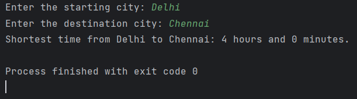

# Flight Time Optimizer

## Description
The **Flight Time Optimizer** is a Java-based application that calculates the shortest travel time between Indian cities using **Dijkstra's Algorithm**. It includes realistic flight durations and layover times to provide accurate and efficient flight plans.

---

## Features
- **Popular Indian Cities**:
  Includes Delhi, Mumbai, Bangalore, Chennai, Kolkata, and Hyderabad with predefined flight routes and times.
- **Shortest Travel Time**:
  Calculates the shortest travel time between two cities using Dijkstra's Algorithm.
- **Realistic Durations**:
  Accounts for exact flight durations and layover times for realistic travel calculations.
- **User Interaction**:
  Takes user input for the starting city and destination city, then displays the shortest time.

---

## Methods Used
1. **Dijkstra's Algorithm**:
    - Used for finding the shortest travel time (flight time + layover).
    - Implemented using a priority queue for efficiency.
2. **Graph Representation**:
    - Uses an adjacency list to represent the graph of cities and flight connections.

---
## Example

---

## Cities and Flight Details
The following are the predefined flight durations and layover times (in minutes):

| **Source**   | **Destination** | **Flight Time** | **Layover** |
|--------------|-----------------|-----------------|-------------|
| Delhi        | Mumbai          | 120             | 30          |
| Delhi        | Bangalore       | 150             | 20          |
| Delhi        | Kolkata         | 130             | 15          |
| Mumbai       | Chennai         | 110             | 25          |
| Mumbai       | Hyderabad       | 90              | 20          |
| Bangalore    | Kolkata         | 180             | 40          |
| Bangalore    | Chennai         | 60              | 10          |
| Kolkata      | Hyderabad       | 150             | 30          |
| Hyderabad    | Chennai         | 70              | 15          |

---

## Technologies Used
- **Language**: Java
- **Algorithm**: Dijkstra's Algorithm
- **Data Structures**: Priority Queue, Adjacency List

